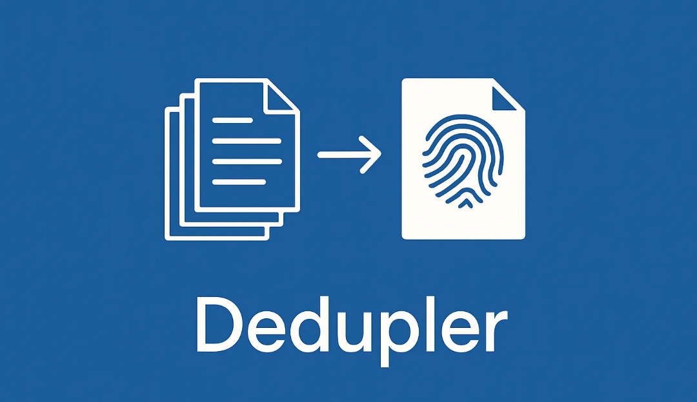

# Dedupler

### Stop storing duplicate files in your Laravel application.

Tired of seeing the same file stored multiple times? When users upload duplicates, your storage bloats, backups grow, and data consistency suffers.

**Dedupler** is an elegant Laravel package that solves this once and for all. It automatically prevents file duplicates using SHA-1 hashing and provides a beautiful polymorphic API to manage your attachments.

## ✨ Why Dedupler?

- 🚫 **Zero Duplicates** - Automatic deduplication using SHA-1 hashing
- 🔗 **Polymorphic Magic** - Attach files to any model with ease
- 💾 **Storage Efficient** - Save significant disk space
- 🎯 **Simple API** - Intuitive methods for attachment management
- ⚡  **Laravel Native** - Seamlessly integrates with Laravel's ecosystem

## 🚀 Quick Start



### 1. Install via Composer
```bash
composer require maxkhim/laravel-storage-dedupler
```

### 2. Install via artisan
```bash
php artisan dedupler:install
```

### 3. Add Trait to Your Model

```php
<?php

namespace App\Models;

use Illuminate\Database\Eloquent\Model;
use Maxkhim\Dedupler\Traits\Deduplable;

class Post extends Model
{
    use Deduplable;
}

```


## 📌 Доступные переменные окружения

| Переменная             | Значение по умолчанию | Описание                                                                                   |
|------------------------|-----------------------|--------------------------------------------------------------------------------------------|
| `DEDUPLER_ENABLED`     | `true`                | Включение/отключение функционала пакета (значение `false` отключает проверку уникальности) |
| `DEDUPLER_DB_HOST`     | `127.0.0.1`           | Хост базы данных для хранения информации о файлах                                          |
| `DEDUPLER_DB_PORT`     | `3306`                | Порт базы данных                                                                           |
| `DEDUPLER_DB_DATABASE` | `unique_files`        | Имя базы данных                                                                            |
| `DEDUPLER_DB_USERNAME` | `unique_files_dbo`    | Имя пользователя БД                                                                        |
| `DEDUPLER_DB_PASSWORD` | `(пустая строка)`     | Пароль пользователя БД                                                                     |
| `DEDUPLER_DB_DRIVER`   | `mariadb`             | Драйвер БД (например, `mysql`, `pgsql`, `sqlite`, `sqlsrv`)                                |

### 🧪 Пример .env

```env
DEDUPLER=true
DEDUPLER_DB_HOST=localhost
DEDUPLER_DB_PORT=3306
DEDUPLER_DB_DATABASE=my_unique_files_db
DEDUPLER_DB_USERNAME=db_user
DEDUPLER_DB_PASSWORD=your_password
DEDUPLER_DB_DRIVER=mysql
```

```
php artisan config:clear
```


## License

The MIT License (MIT).